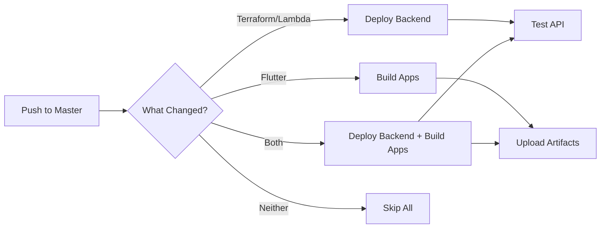

# GitHub Actions Setup Guide

This guide explains how to configure GitHub Actions for automated deployment of the WHI backend and mobile app builds.

## Workflows Overview

### Automatic Workflows (Push to Master)

1. **`auto-deploy-master.yml`** - 🆕 **Automatic deployment on push to master**
   - Deploys backend if Terraform/Lambda files changed
   - Builds apps if Flutter files changed
   - Intelligent change detection
   - Runs automatically on every push to master

### Manual/Automatic Workflows

2. **`deploy-backend.yml`** - Deploys the serverless backend to AWS
   - **Automatic**: Triggers on push to master (Terraform/Lambda changes)
   - **Manual**: Can be triggered with specific options

3. **`build-app-stores.yml`** - Builds Android AAB and iOS IPA for app stores
   - **Automatic**: Triggers on push to master (Flutter changes)
   - **Manual**: Can be triggered with version configuration

### Manual Only Workflow

4. **`full-deployment.yml`** - Combined workflow for complete deployment
   - Manual trigger only with full control

## Required GitHub Secrets

### AWS Credentials (Required for Backend)

Go to your repository's **Settings → Secrets and variables → Actions** and add:

| Secret Name | Description | How to Get |
|------------|-------------|------------|
| `AWS_ACCESS_KEY_ID` | AWS IAM user access key | AWS Console → IAM → Users → Security credentials |
| `AWS_SECRET_ACCESS_KEY` | AWS IAM user secret key | AWS Console → IAM → Users → Security credentials |

**IAM Permissions Required:**
- S3: Create/manage buckets
- DynamoDB: Create/manage tables
- Lambda: Create/manage functions
- API Gateway: Create/manage APIs
- CloudFront: Create/manage distributions
- IAM: Create roles and policies
- CloudWatch: Create event rules

### Android Signing (Optional - for Play Store releases)

| Secret Name | Description | How to Create |
|------------|-------------|---------------|
| `ANDROID_KEYSTORE_BASE64` | Base64-encoded keystore file | See below |
| `ANDROID_KEY_PROPERTIES` | Key properties configuration | See below |

#### Creating Android Signing Secrets:

1. **Generate a keystore** (if you don't have one):
```bash
keytool -genkey -v -keystore upload-keystore.jks \
  -keyalg RSA -keysize 2048 -validity 10000 \
  -alias upload
```

2. **Convert keystore to base64**:
```bash
base64 -i upload-keystore.jks | pbcopy  # macOS
base64 upload-keystore.jks | xclip -selection clipboard  # Linux
```

3. **Create key.properties content**:
```properties
storePassword=YOUR_STORE_PASSWORD
keyPassword=YOUR_KEY_PASSWORD
keyAlias=upload
storeFile=upload-keystore.jks
```

4. Add both as secrets in GitHub.

### iOS Signing (Optional - for App Store releases)

| Secret Name | Description | How to Create |
|------------|-------------|---------------|
| `IOS_BUILD_CERTIFICATE_BASE64` | Base64-encoded P12 certificate | See below |
| `IOS_P12_PASSWORD` | Password for P12 certificate | Your certificate password |
| `IOS_PROVISION_PROFILE_BASE64` | Base64-encoded provisioning profile | See below |
| `IOS_KEYCHAIN_PASSWORD` | Temporary keychain password | Any secure password |

#### Creating iOS Signing Secrets:

1. **Export certificate from Keychain**:
   - Open Keychain Access
   - Find your "Apple Development" or "Apple Distribution" certificate
   - Right-click → Export
   - Save as .p12 with a password

2. **Convert certificate to base64**:
```bash
base64 -i Certificates.p12 | pbcopy  # macOS
```

3. **Download provisioning profile**:
   - Go to [Apple Developer Portal](https://developer.apple.com)
   - Certificates, IDs & Profiles → Profiles
   - Download your app's provisioning profile

4. **Convert profile to base64**:
```bash
base64 -i YourApp.mobileprovision | pbcopy  # macOS
```

5. Add all secrets to GitHub.

## Automatic Deployment (Push to Master)

When you push to the master branch, the `auto-deploy-master.yml` workflow automatically:

1. **Checks what changed** in your commit
2. **Deploys backend** if Terraform or Lambda files were modified
3. **Builds apps** if Flutter files were modified
4. **Skips unchanged components** to save time and resources

### How It Works



### Example Scenarios

**Scenario 1: Backend Change**
```bash
# Edit lambda/whi_handler.py
git add lambda/whi_handler.py
git commit -m "Update Lambda function"
git push origin master
# ✅ Backend deploys automatically
# ⏭️ Apps skip (no Flutter changes)
```

**Scenario 2: Flutter Change**
```bash
# Edit whi_flutter/lib/main.dart
git add whi_flutter/lib/main.dart
git commit -m "Update UI"
git push origin master
# ⏭️ Backend skips (no Terraform/Lambda changes)
# ✅ Apps build automatically
```

**Scenario 3: Full Stack Change**
```bash
# Edit both backend and app
git add .
git commit -m "Update backend and UI"
git push origin master
# ✅ Backend deploys
# ✅ Apps build with new backend URL
```

### Build Numbers

- Automatic builds use the GitHub run number as the build number
- Version defaults to `1.0.0` unless you use a version tag
- To set a specific version, use tags:
  ```bash
  git tag v2.1.0
  git push origin v2.1.0
  ```

## Running the Workflows

### Deploy Backend Only

1. Go to **Actions** tab
2. Select **Deploy Backend Infrastructure**
3. Click **Run workflow**
4. Choose options:
   - Environment: `production`
   - Terraform action: `apply`
5. Click **Run workflow**

### Build Apps Only

1. Go to **Actions** tab
2. Select **Build App Store Bundles**
3. Click **Run workflow**
4. Configure:
   - Build Android: `true/false`
   - Build iOS: `true/false`
   - Build mode: `release` (for stores) or `debug`
   - Version name: e.g., `1.0.0`
   - Build number: e.g., `1`
   - CloudFront URL: (leave empty for local or paste from backend deployment)
5. Click **Run workflow**

### Full Deployment

1. Go to **Actions** tab
2. Select **Full Deployment Pipeline**
3. Click **Run workflow**
4. Configure:
   - Deploy backend: `true/false`
   - Build apps: `true/false`
   - Version name: e.g., `1.0.0`
   - Build number: e.g., `1`
5. Click **Run workflow**

## Controlling Automatic Deployment

### Automatic Deployment is Now Enabled

Pushing to master automatically triggers:
- Backend deployment (if Terraform/Lambda files change)
- App builds (if Flutter files change)

### To Disable Automatic Deployment

If you want to disable automatic deployment and only use manual triggers:

1. **Comment out the push triggers** in workflows:
   - `.github/workflows/auto-deploy-master.yml` - Comment lines 5-10
   - `.github/workflows/deploy-backend.yml` - Comment lines 5-11
   - `.github/workflows/build-app-stores.yml` - Comment lines 5-12

2. **Or delete the auto-deploy workflow**:
   ```bash
   rm .github/workflows/auto-deploy-master.yml
   ```

### To Skip CI for a Specific Commit

Add `[skip ci]` to your commit message:
```bash
git commit -m "Update README [skip ci]"
git push origin master
# No workflows will run for this commit
```

## Enabling Additional Automatic Triggers

To enable automatic deployment on other events:

### For Backend (on push to main)

Edit `.github/workflows/deploy-backend.yml`:
```yaml
on:
  push:
    branches:
      - main
    paths:
      - 'terraform/**'
      - 'lambda/**'
      - '.github/workflows/deploy-backend.yml'

  workflow_dispatch:  # Keep manual trigger
    # ... existing config
```

### For App Builds (on version tags)

Edit `.github/workflows/build-app-stores.yml`:
```yaml
on:
  push:
    tags:
      - 'v*'

  workflow_dispatch:  # Keep manual trigger
    # ... existing config
```

### For Full Deployment (on release tags)

Edit `.github/workflows/full-deployment.yml`:
```yaml
on:
  push:
    tags:
      - 'release-*'

  workflow_dispatch:  # Keep manual trigger
    # ... existing config
```

## First-Time Setup Checklist

### Minimum Setup (Automatic Deployment)

- [ ] Add AWS credentials to GitHub Secrets (`AWS_ACCESS_KEY_ID`, `AWS_SECRET_ACCESS_KEY`)
- [ ] Push to master branch - everything deploys automatically!
- [ ] Check Actions tab for deployment status
- [ ] CloudFront URL is automatically configured in app builds

### Full Setup (For App Store Releases)

- [ ] Add AWS credentials to GitHub Secrets
- [ ] (Optional) Add Android signing secrets for Play Store
- [ ] (Optional) Add iOS signing secrets for App Store
- [ ] Push to master - automatic deployment starts
- [ ] Download artifacts from Actions tab
- [ ] Upload to Google Play Console and App Store Connect

### Testing the Setup

1. **Make a small change** to any file
2. **Commit and push** to master:
   ```bash
   git add .
   git commit -m "Test automatic deployment"
   git push origin master
   ```
3. **Watch the magic** in the Actions tab!
4. **Download artifacts** if apps were built

## Troubleshooting

### Backend Deployment Fails

1. **Check AWS credentials**: Ensure secrets are set correctly
2. **Check AWS permissions**: IAM user needs the permissions listed above
3. **Check Terraform state**: May need to manually clean up failed resources

### Android Build Fails

1. **Check Java version**: Needs Java 17
2. **Check Flutter version**: Should match local development (3.27.1)
3. **Check signing**: For release builds, keystore secrets must be set

### iOS Build Fails

1. **Check certificates**: Ensure P12 and provisioning profile are valid
2. **Check bundle ID**: Must match provisioning profile
3. **Check Xcode version**: GitHub Actions uses latest Xcode

### Artifacts Not Found

Build artifacts are retained for 30 days. Download them from the workflow run page under "Artifacts" section.

## Cost Considerations

- **GitHub Actions**: 2,000 free minutes/month for private repos
- **AWS Backend**: < $5/month for typical usage
- Each full deployment uses approximately:
  - Backend: ~5 minutes
  - Android build: ~10 minutes
  - iOS build: ~15 minutes

## Security Best Practices

1. **Rotate credentials regularly**: Update AWS keys every 90 days
2. **Use least privilege**: Create dedicated IAM user for GitHub Actions
3. **Protect branches**: Enable branch protection for main/master
4. **Review permissions**: Audit workflow permissions regularly
5. **Keep secrets secret**: Never commit credentials to the repository

## Support

For issues with:
- **Workflows**: Check Actions tab for logs
- **AWS**: Check CloudWatch logs in AWS Console
- **Signing**: Verify certificates haven't expired