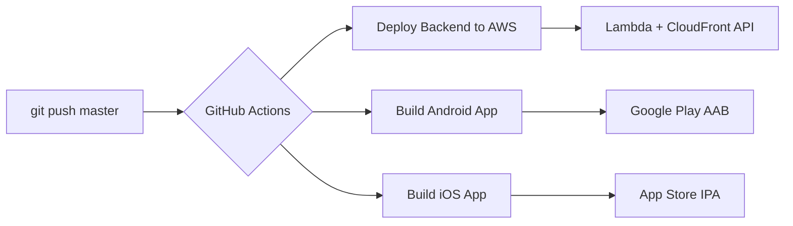

# Waffle House Index Project

A comprehensive system for tracking the Waffle House Index - an informal metric indicating the severity of disasters based on the operational status of Waffle House restaurants.

## Status: ✅ Working (January 2026)

All components are fully functional:
- Python CLI extracts data correctly from Next.js website
- Django backend API provides reliable data endpoints
- Flutter app works on Linux with API backend

## Components

### 1. Python CLI (`python_cli/`)
- Command-line tool for checking the Waffle House Index
- Supports lookup by ZIP code with configurable radius
- Extracts data from Waffle House website (Next.js)

### 2. Django Backend API (`whi_backend/`)
- REST API providing Waffle House Index data
- Reliable data extraction using Python
- Endpoints for coordinates, ZIP codes, and all locations
- CORS-enabled for cross-origin requests

### 3. Flutter Mobile/Desktop App (`whi_flutter/`)
- Cross-platform app (Android, iOS, Linux, Web)
- **Adjustable radius slider** (10-100 miles) with live updates
- **Visual status indicator** showing disaster severity levels
- Shows nearby Waffle House locations within selected radius
- Displays open/closed status and calculates index
- Uses device location or fallback coordinates

## 🚀 Deployment & CI/CD

### Automatic Deployment on Push to Master ✨

**Just push to master and everything deploys automatically!**



This project includes complete CI/CD pipelines:

- **🔄 Automatic**: Push to master triggers smart deployment (only changed components)
- **🎯 Backend**: Serverless API on AWS (Lambda + CloudFront) - < $5/month
- **📱 Mobile Apps**: Android AAB and iOS IPA ready for app stores
- **🎮 Manual Control**: Override with manual workflow triggers

See [.github/GITHUB_ACTIONS_SETUP.md](.github/GITHUB_ACTIONS_SETUP.md) for setup instructions.

### AWS Deployment (Production)

Deploy the backend to AWS with one command:

```bash
./deploy.sh  # Deploys Lambda, API Gateway, DynamoDB, CloudFront
```

Estimated cost: **< $5/month** (serverless, pay-per-use)

See [DEPLOYMENT.md](DEPLOYMENT.md) for detailed AWS deployment instructions.

## Quick Start

### Option 1: Run Everything with One Command

```bash
# Run both backend and frontend
./run_full_app.sh
```

This script will:
1. Start the Django backend API
2. Verify the API is working
3. Launch the Flutter app
4. Handle graceful shutdown

### Option 2: Run Components Separately

#### Backend API
```bash
cd whi_backend
pip install -r requirements.txt
python manage.py migrate
python manage.py runserver 0.0.0.0:8000
```

#### Flutter App
```bash
cd whi_flutter
flutter pub get
flutter run -d linux  # or -d android, -d ios, etc.
```

#### Python CLI
```bash
cd python_cli
python whi_zip.py
```

## API Endpoints

- `GET /api/health/` - Health check
- `GET /api/index/coordinates/?lat=<lat>&lon=<lon>&radius=<radius>` - Get index by coordinates
- `GET /api/index/zip/?zip=<zip>&radius=<radius>` - Get index by ZIP code
- `GET /api/locations/` - Get all locations with status

## Testing

Run the full stack test:
```bash
python test_full_stack.py
```

This verifies:
- Django backend is running
- API endpoints are responding correctly
- Data extraction from Waffle House website works
- Index calculations are accurate

## Status Determination

The system determines if a location is open based on the `_status` field from the Waffle House website:
- `_status: "A"` = Active/Open ✅
- Any other value = Closed ❌

## Architecture

```
┌─────────────────┐     ┌─────────────────┐
│  Flutter App    │────▶│  Django API     │
│  (Frontend)     │     │  (Backend)      │
└─────────────────┘     └────────┬────────┘
                                 │
                                 ▼
                    ┌─────────────────────┐
                    │ Waffle House Website│
                    │ (Data Source)       │
                    └─────────────────────┘
```

## Development

### Flutter App Configuration

To change the API server URL (e.g., for network access):

Edit `whi_flutter/lib/main.dart` line 223:
```dart
static const String _apiBaseUrl = 'http://192.168.1.100:8000';  // Your server IP
```

### Django Settings

For production deployment:
1. Set `DEBUG = False` in `whi_backend/whi_api/settings.py`
2. Update `ALLOWED_HOSTS` with your domain
3. Configure proper CORS settings
4. Use a production server (gunicorn, uwsgi)

## Requirements

### System Requirements
- Python 3.8+
- Flutter 3.0+
- Linux: GTK3, CMake, Ninja, Clang (for Flutter desktop)

### Python Dependencies
- Django 5.0.1
- Django REST Framework 3.14.0
- django-cors-headers 4.3.1
- requests 2.31.0

### Flutter Dependencies
- geolocator (with platform-specific packages)
- http
- Flutter SDK

## Troubleshooting

### Port Already in Use
```bash
pkill -f "manage.py runserver"
```

### Flutter Linux Build Issues
```bash
cd whi_flutter
flutter clean
flutter pub get
flutter build linux --debug
```

### Location Services on Linux
The Flutter app will automatically fall back to Atlanta, GA coordinates if location services are unavailable. To enable actual location:
```bash
sudo apt install geoclue-2.0  # Ubuntu/Debian
sudo systemctl start geoclue
```

## Background

The Waffle House Index was created by former FEMA administrator Craig Fugate as an informal metric to assess the impact of disasters. The logic is simple:
- **Green**: Full menu - limited impact
- **Yellow**: Limited menu - partial impact
- **Red**: Closed - severe impact

This project provides tools to monitor the real-time status of Waffle House locations and compute the index for any given area.

## License

This project is for educational purposes. The Waffle House Index is an informal metric and this tool is not affiliated with Waffle House, Inc.

## Notes

- Data accuracy depends on the Waffle House website
- Distance calculations use straight-line distance
- Status may not reflect real-time restaurant operations
- Use responsibly and respect the data source

## Code of Conduct

Please note that this project is released with a Contributor Code of Conduct. By participating in this project you agree to abide by its terms.